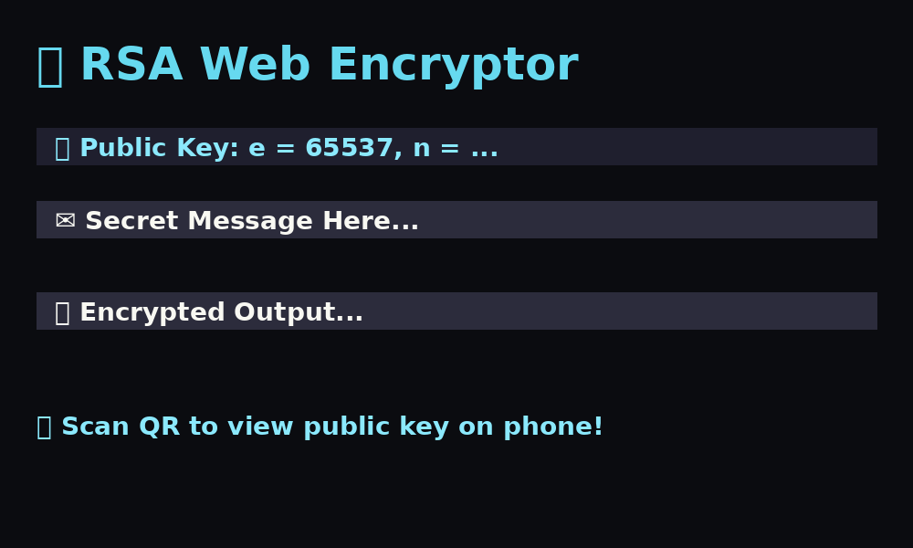

# 🔐 RSA Web Encryptor

A fully in-browser RSA encryption and decryption tool built with **HTML**, **CSS**, and **JavaScript** — no backend required. Supports public key sharing via QR code and works on desktop and mobile!



---

## 🚀 Features

- 🔒 Generate RSA key pairs
- ✉️ Encrypt & decrypt messages in-browser
- 📱 Generate QR code for public key sharing
- 🌐 Mobile-friendly + no server needed
- 🎨 Styled with futuristic neon CSS
- 📄 Pure frontend: no external frameworks or backend

---

## 🌐 Live Demo

[🔗 Click here to open](https://yourusername.github.io/rsa-web-encryptor/)

> Replace `yourusername` with your GitHub username after deployment.

---

## 📁 Files Overview

| File        | Purpose                         |
|-------------|----------------------------------|
| `index.html`| Main UI for key generation & encryption |
| `qr.html`   | Public key viewer opened via QR scan |
| `style.css` | (Optional) External styles if separated |
| `README.md` | This documentation              |

---

## 📸 QR Code Usage

1. Click "Generate RSA Keys"
2. A QR code will appear — scan it with any phone
3. You’ll be taken to `qr.html` with the public key
4. Use the public key for encryption from another device

---

## 🛠️ How to Use

1. 🔃 Click **"Generate RSA Keys"**
2. ✍️ Type a secret message in the input box
3. 🔒 Click **"Encrypt"**
4. 🧱 Encrypted data appears — copy & share
5. 🔓 Paste into Encrypted box and click **"Decrypt"** to verify

---

## 📦 Deployment (GitHub Pages)

1. Upload all files to a public GitHub repository
2. Go to **Settings → Pages** → Choose main branch (or `/docs`)
3. You’ll get a link like:
   ```
   https://yourusername.github.io/rsa-web-encryptor/
   ```
4. That’s it! ✅ QR codes will now work on **mobile too**

---

## 📜 License

MIT License — free to use, modify, or share.

---

## 💡 Note

This tool uses **basic RSA with small primes** for educational purposes. **Do not use for production or secure communications**.

---

## 🙌 Acknowledgements

- [QRCode.js](https://github.com/davidshimjs/qrcodejs)
- You, for testing encryption on the web ✨
